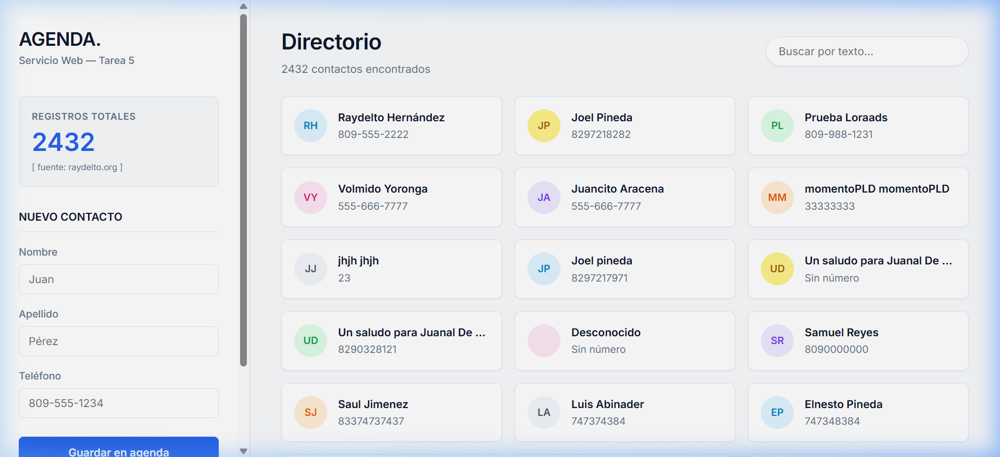

# Tarea 5: Servicio Web

Esta es la Tarea 5, Servicio Web. Para Raydelto Hernandez.  
**Robert Plaza Brito 2024-2174**

Este es un servicio Web construido con Node.js y Express.js que actúa como intermediario (proxy) para consumir el API de agenda de contactos ubicada en `http://www.raydelto.org/agenda.php`.

  - `css/styles.css`: Hojas de estilo modernas y responsivas.
  - `js/script.js`: Lógica del cliente que se comunica de forma asincrónica con la API.

## Vista Previa

## Cómo ejecutar

Aqui le dejo una captura de pantalla de como se ve la agenda de contactos:
